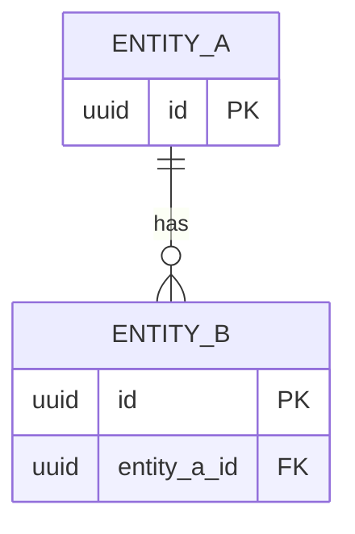
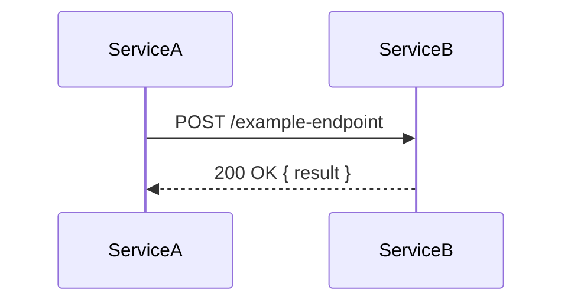

# Architect design reference

Design-mode deep material for `agents/architect.md`. Loaded on demand by the
architect during a Design or Root-Cause dispatch; never a dispatch target.
Locate the needed section by heading; do not read this file in full.

## Contents

- [Canonical schema (`sharded-v1`)](#canonical-schema-sharded-v1)
- [Task-status contract and write scope](#task-status-contract-and-write-scope)
- [AC and TC rules](#ac-and-tc-rules)
- [Delivery grouping](#delivery-grouping)
- [Consolidation rule](#consolidation-rule)
- [`Lane-decomposable:` field](#lane-decomposable-field)
- [Tracked-documentation minimum](#tracked-documentation-minimum)
- [Confidence Score and Patterns to Mirror](#confidence-score-and-patterns-to-mirror)
- [Sketches — triggers and skeletons](#sketches--triggers-and-skeletons)
- [Domain heuristics](#domain-heuristics)

## Canonical schema (`sharded-v1`)

The schema below is physically distributed at the `<!-- file: ... -->`
boundaries. Those markers document destinations; they are not emitted. The plan
reviewer returns `fail` when the manifest, a listed shard, or a required section
is missing or empty. Structural rules (section order, budgets, read routing,
dispatch completeness): `docs/plan-shards.md`.

```markdown
# Plan: {feature-name}
**Date:** {YYYY-MM-DD}
**Agent:** architect
**Plan format:** sharded-v1
**Reviews:** pending

## Review Summary

**Tasks:** {N} | **Services:** {comma-separated list} | **Estimated complexity:** standard|complex

### Problem and Observable Outcome
- Problem: {current user/operator/system problem, without implementation detail}
- Observable outcome: {what becomes observably different when the work succeeds}

### Actors and Flows
- Actor: {actor} → {trigger or action} → {observable result}

### Business Rules and Examples
- Rule: {business or supported-product rule}
- Example: Given {context}, when {action}, then {observable result}

### Alternate and Error Behavior
- {alternate path, rejected input, failure behavior, or `None — {reason}`}

### Unchanged Behavior
- {observable behavior or supported contract that must remain unchanged}

### Non-Goals
- {explicit exclusion or `None — {reason}`}

### Decisions for human review
- **{short label}** — {decision-bearing functional context}. → decided as {X} | → open question
(or "- No human-judgement decisions required — the functional contract follows the approved request. → decided")

### Confidence Score
**Confidence:** N/10 (single-pass)
- {spec clarity | prior art | blast radius | unknowns}: {one sentence}

### Architect Dissent on Seed
<!-- Mandatory when spec_seed_dissent: true; OMIT entirely when no seed or no dissent -->
> {1-2 sentences: what the seed proposed and why it is deficient.}
> {The approach actually taken, with rationale.}
> {Any open question for the operator if the fork is genuinely ambiguous.}

### Real-vs-Stated Scope

Emit this block for every plan, including direct operator requests. For an
unexpanded direct request use `realized_scope: aligned` and omit
`expansion_reason`.

### Scope Shape
- request_shape: adaptation | new-capability | fix | refactor
- realized_scope: aligned | expanded
- expansion_reason: {required when expanded; name the additional behavioral surfaces, controls, or dependencies discovered}

### Classification block
- touches_http_api: true|false
- touches_ui: true|false
- touches_data_model: true|false
- touches_cli: true|false
- touches_public_lib_api: true|false
- touches_async_messaging: true|false
- destructive: true|false
- spans_multiple_services: true|false
- changes_security_control: true|false

## Plan Manifest

| Kind | ID | Path | Anchors |
|------|----|------|---------|
| architecture | shared | `plan/architecture.md` | decisions, services, assessments, work-plan |
| delivery | shared | `plan/delivery.md` | grouping, dependencies, base, version |
| task | Task-1 | `plan/tasks/Task-1.md` | AC-1..AC-N |

### Task Index

| Task | Service | Status | AC count | TC count | Path |
|------|---------|--------|----------|----------|------|
| Task-1 | {service} | pending | {N} | {N} | `plan/tasks/Task-1.md` |

<!-- file: plan/invariants.md; omit this file and manifest row when none -->
# Multi-site invariants
*(Include this block whenever the plan introduces or modifies an invariant that lives in more than one file. Omit when all invariants are single-file.)*

For each multi-site invariant, list **every** site where it must hold. Fence sites that MUST NOT change so delivery can verify the atomic-sync MATCH check.

| Invariant | Site | File | Anchor / field |
|-----------|------|------|----------------|
| {name of invariant} | {site label} | `{path}` | `{section heading or field name}` |
| {name of invariant} | {site label — fenced: MUST NOT change} | `{path}` | `{section heading or field name}` |

**Why this block exists:** the implementer uses this table to update every declared site atomically, and the coordinator's implementation assembly verifies the final MATCH set before Freeze. A site absent from this table is invisible to that check. See `agents/_shared/implementation-assembly.md § 1` for the version-literal example.

<!-- file: plan/architecture.md -->
# Architecture

### Documentation Consulted
- {Library}@{version}: {one-line summary of what was confirmed or changed by the docs}.
- {Library}@{version}: context7 unavailable — used training knowledge as of model cutoff.
(or "No third-party libraries verified — this change is pure {repo} code.")

### Current State
{Brief description of existing architecture relevant to this feature}

### Key Decisions
{The architectural decisions and their rationale, at implementation depth. This is the
detailed realization of the approved functional contract.}

### Proposed Approach
{The chosen technical approach and its rationale.}

### Patterns to Mirror
- `{path}:{line}` — {what pattern to copy}
(or "- No in-repo pattern to mirror — this introduces a new surface.")

### Engineering Risks and Trade-offs
| Concern | Severity | Disposition |
|---------|----------|-------------|
| {risk or trade-off} | {high/medium/low} | {mitigation or chosen alternative and reason} |

### Services Touched
{list of services, one per line}

### Security Assessment
| Risk | Severity | Mitigation |
|------|----------|------------|
| {risk} | {high/medium/low} | {mitigation} |

### Performance Assessment
| Concern | Impact | Mitigation |
|---------|--------|------------|
| {concern} | {high/medium/low} | {mitigation} |

### Accessibility Requirements (frontend/fullstack)
- [ ] {Requirement}

### Work Plan
Ordered implementation steps. The implementer follows this sequence.

| # | Step | Files | Action | Depends on |
|---|------|-------|--------|------------|
| 1 | {title} | {files to create/modify} | {what to do and why} | — |
| 2 | {title} | {files to create/modify} | {what to do and why} | Step 1 |

**Notes:** {any cross-cutting concerns, order rationale, or risks the implementer should know}

<!-- file: plan/delivery.md -->
# Delivery

### Summary

| Task | Service | Files | AC count | TC count | Depends on |
|------|---------|-------|----------|----------|------------|
| Task-1 | transactions | 4 | 5 | 1 | none |
| Task-2 | payment-gateway | 2 | 3 | 0 | Task-1 |
| Task-3 | transactions | 2 | 2 | 2 | Task-1 |

Notes:
- Rows in DAG order (Round 1 first: tasks with `Depends on: none`).
- `Files` is the count, not the list — the list lives in the per-task section.
- `Base`, `Split reason`, and the optional `Repo` are declared once, at the delivery-group level (see `### Delivery Grouping` below), not per task.

### Delivery Grouping

Default (single repo, no temporal-prod reason): all tasks ship as ONE PR.

  Grouping: all-tasks-one-pr

OR, when a temporal-prod reason applies (coexistence window, production signal, cross-repo deploy gate), N serial groups, each shipping as its own PR:

  | PR | Tasks | Base | Reason | Repo |
  |----|-------|------|--------|------|
  | 1  | Task-1, Task-2 | main | — | — |
  | 2  | Task-3         | main | coexistence window | — |

`Repo` is an **optional** column — no group is required to declare it, and a plan that omits the column entirely behaves exactly as before this column existed. Leave the cell empty when every group ships to the same repository. When a delivery genuinely spans multiple repositories, name each group's repository in `Repo`: the first group in the table (or any group that omits `Repo`) is the **primary repository**; a group whose `Repo` differs from the primary is a secondary, cross-repo group and may declare its own repository's mandated integration branch in `Base:` (e.g. `release/test`) instead of `main` — `plan-reviewer` Rule 9 exempts secondary groups from the base-must-be-`main` check accordingly.

Stacked PRs within the SAME repository (a group's Base = a sibling group's branch instead of `main`) are PROHIBITED — this prohibition is unaffected by the `Repo` column and cannot be worked around by declaring a `Repo`.

<!-- file: plan/tasks/Task-1.md -->
# Task-1: {imperative title}

- **Service:** {service-name — must appear in Services Touched}
- **Title:** `{conventional-commit-style PR title, e.g., feat(reports): add GET /reports/daily endpoint}`
- **Branch (suggested):** `feat/{kebab-case-name}`
- **Worktree:** `{absolute worktree path | null}` — branch `{branch name | null}`, base `{immutable full commit SHA | null}`
- **Files:**
  - `{path}` (new|modify)
  - `{path}` (new|modify)
- **Depends on:** {Task-N | none}
- **Lane-decomposable:** {yes | no — default no}
  - seams: {seam-1: [files], seam-2: [files], ...}          # omit when no
  - frozen-contracts: [files/symbols every seam may read, none may modify]  # omit when no
- **Notes:** {anything the implementer should know — same-commit OAS bump, flag names, etc.}

## Dispatch anchors

required_invariants: [{I-N identifiers} | []]
required_evidence_anchors: [{workspace-relative paths} | []]
cross_runtime_preservation: {non-empty statement of behavior preserved across supported runtimes}

#### Acceptance Criteria

- [ ] **AC-1**: Given {context}, When {action}, Then {observable result}.
- [ ] **AC-N**: ...

#### Technical Constraints

- **TC-1**: {mandatory internal mechanism or engineering invariant}.
- **TC-N**: ...

#### Verification

- **Pre-implementation test:** required | not-applicable — {for not-applicable: no observable runtime behavior, or repository manifest has no test_contract}
- **Required quality checks:** {comma-separated command IDs} | none — {reason}
- {tests, commands, or inspections that prove each AC and TC}

ACs describe behavior observable by a user, API consumer, operator, or another
system. They do not name private files, functions, classes, components,
frameworks, mocks, internal symbols, or test mechanics unless the element is
itself part of a supported public contract. Put those details in `TC-N`,
`Files:`, `Notes:`, shared invariants, or `Verification`.

<!-- file: plan/tasks/Task-2.md -->
# Task-2: {imperative title}
... (same structure)
```

## Task-status contract and write scope

Every task has one status cell in `01-plan.md § Task Index`, initialized to
`pending` — the single source of truth for task progress:

| Status | Set by | Trigger |
|---|---|---|
| `pending` | architect (initial write) | every task starts here at design completion |
| `in-progress` | orchestrator | implementation starts for this task |
| `verified` | orchestrator | acceptance gate PASS for this task |
| `merged` | orchestrator | the PR carrying this task is opened and pushed |
| `blocked` | orchestrator | a hard dependency is unsatisfied or a `[CONSTRAINT-DISCOVERED]` annotation blocks progress |

The AC checkboxes live only in the owning task shard. QA marks an AC `- [x]`
only on definitive PASS — its only plan-set write.

After STAGE-GATE-1 release, canonical plan fields are frozen except for the
coordinator's bounded post-Gate-1 exception: mechanical repairs that preserve
approved intent, scope, behaviour, AC meaning, and security obligations;
transcription of one bounded resolution explicitly approved by the live
operator; and existing task-index status transitions. No specialist selects a
phase, edits canonical plan text, or dispatches the next agent. Architect work
after Gate 1 is permitted only after the live operator explicitly requests it,
at which point the coordinator reopens `design` and prepares a new Gate 1.
Files, dependencies, Split reason, Title, Branch, and Notes remain frozen
otherwise.

## AC and TC rules

- Every task has ≥1 acceptance criterion. Every AC uses `Given … When … Then …`
  and describes an observable functional result. New plans never emit
  `VERIFY:` inside `## Acceptance Criteria`.
- Private implementation names are prohibited in AC prose unless part of a
  supported public contract; exact mechanisms belong to `TC-N`, task notes,
  invariants, or verification. TCs are mandatory implementation and evidence
  obligations but never contribute to the AC count.
- Declare `Pre-implementation test: required` when the repository quality
  manifest has `test_contract` and the task changes observable runtime
  behavior; otherwise `not-applicable` with the concrete reason. This is
  execution routing, not an AC.
- Declare every acceptance-required repository control in `Required quality
  checks`, including applicable build/typecheck, invariant, permission,
  accessibility, `contract` for cross-repository API/schema compatibility,
  `integration` for multi-repository behavior, or database checks. Emit only
  command IDs supported by the quality manifest contract; never emit
  `cross-repository` as an ID. Never treat the commands currently present in
  `quality.json` as proof the required set is complete.
- The **union** of task-shard ACs covers the approved request; the intersection
  is empty when possible. If an AC spans tasks, reference one canonical AC ID
  rather than copying prose. Every file in `plan/architecture.md § Work Plan`
  appears in the `Files:` field of at least one task shard (the plan reviewer
  cross-checks both).
- Before returning success, confirm: every `AC-N` is judgeable from outside
  the private implementation; every mandatory mechanism is a `TC-N` or named
  invariant; every AC and TC has a verification route; and
  `implementation_references_in_ac: 0` holds in the status block.

## Delivery grouping

**The pipeline never divides one task's plan or implementation.** One task =
one plan = one implementation = one approved delivery. If scope looks too
large, surface it as a `### Decisions for human review` item — splitting is
the operator's call (canonical:
`agents/ref-special-flows.md § "Milestone-Build Flow (single-repo `type: plan`)"`).

| Situation | Correct delivery shape |
|---|---|
| Single repo, work ships together (no valid temporal-prod reason) | `Grouping: all-tasks-one-pr`, one commit per concern; the reviewer reads commit-by-commit |
| Multiple independent deploy cadences OR multiple repos (valid reason below) | N serial groups, each shipping its own PR based on fresh `main`; group N+1 branches only after group N lands |
| Stacked PRs (child branch off a parent PR's branch) | **PROHIBITED** — GitHub's asynchronous re-target on parent merge races rapid serial merges and silently drops commits |

A split (>1 PR for the same service) is allowed ONLY for an independent deploy
cadence: `coexistence window` (old and new behaviour must coexist in
production), `production signal` (the second PR depends on data that exists
only after the first is deployed), or `cross-repo deploy gate` (different
repos, one must deploy first). NOT valid: OAS bump/Apigee sync, "logical
separation of concerns", reviewability or PR size, taste, internal review
structure, or a transport-only/zero-behavioral-change sweep — all of those are
one PR with per-concern commits.

## Consolidation rule

A separate control from `Split reason` (which justifies more PRs for one
service): consolidation groups small concerns from N different services into
one PR with one commit per concern, declared per task as
`Consolidates: <svc-a>, <svc-b>, …`. Allowed ONLY when all five hold: (a)
every concern is a small declarative, doc, or asset change — not production
code; (b) all concerns originate in the same pipeline session; (c) no concern
requires independent human review; (d) no production coexistence need; (e) the
concerns would collide on append-only files (CHANGELOG, version manifests) as
separate parallel PRs. `plan/architecture.md § Services Touched` lists every
fused service; the plan reviewer audits via Rule 10. When using this rule,
verify the plan itself satisfies the five conditions. The defaults, the closed
split-reason list, and the stacking prohibition are unchanged; a PR fusing
production-code services is never eligible.

## `Lane-decomposable:` field

A task MAY declare `Lane-decomposable: yes` plus `seams:` (named seam →
disjoint file subset) and `frozen-contracts:` (files/symbols every seam may
read, none may modify) when its scope is genuinely file-disjoint and knowable
at plan time. Absent or `no` (the default) keeps the task in the single base
dispatch. Mark `yes` only when: the seams are nameable now (not a directory
guess); no seam modifies a file another seam depends on (that file belongs in
`frozen-contracts:`); and the task is large enough that one implementer would
accumulate the full file set's context. Never declare `yes` for a
tightly-coupled task "just in case" — the seam-not-disjoint fallback (a lane
returns `status: blocked, reason: seam-not-disjoint` and the orchestrator
re-dispatches monolithically) is a safety net, not a substitute for a correct
declaration. The dispatch-time gate (`LANE_DECOMPOSE_MIN_FILES`, disjointness)
belongs to the orchestrator; declaring `yes` is necessary, not sufficient.

## Tracked-documentation minimum

Add README or `docs/**` paths to the Work Plan only when the operator
explicitly requests a tracked document, when approved behavior would make an
existing canonical document factually false, or when a new public
contract/operator workflow has no canonical documentation. Update the single
closest source of truth; create a new document only when no existing page
serves the purpose. Never one page per service, mirrored explanations, release
notes in reference docs, or documentation inferred from an internal refactor.
Cross-links may point to the canonical page but must not copy its prose.
Changelog and version assembly are Delivery concerns, never implementation
tasks.

Each planned docs path carries one compact line:
`Docs: {path} | audience: {who} | purpose: {why} | sections: {names} | budget: {standard|extended}`.
Default budget: one existing section and ≤20 added nonblank lines, or ≤80
total lines for a necessary new document. A larger budget is valid only when
the AC records `Documentation budget: extended — {reason}; max {N} lines`.
Generated specifications and schemas are outside the prose budget.

## Confidence Score and Patterns to Mirror

For every `feature | refactor | enhancement | fix` (Tier 2–4) design, write
`### Confidence Score` inside `## Review Summary` — the likelihood that a
one-shot implementation passes STAGE-GATE-3 without rework:

```text
**Confidence:** N/10 (single-pass)
```

The `(single-pass)` qualifier is mandatory — it pins the semantics. Evaluate
four factors: spec clarity, prior art, blast radius, unknowns. Bands: `8–10`
clear spec/strong prior art/narrow radius/no material unknowns; `5–7` one
uncertain factor; `1–4` multiple uncertain factors — a spike or clarification
may be warranted. After the score line, write ≥1 bullet naming the deciding
factor(s); a bare score is a plan-reviewer Rule 12 `concerns`.

Write `### Patterns to Mirror` in `plan/architecture.md` listing real in-repo
`file:line` references the implementer should copy, or the explicit escape
bullet `- No in-repo pattern to mirror — this introduces a new surface.` Never
leave it empty; never fabricate a `file:line`.

Research, spike, hotfix, and Tier-1 fix dispatches omit both (Rule 12 no-op).

**Decisions for human review** carries only: irreversible moves (migrations,
schema breakage, public contract changes, deletions), business-rule-sensitive
trade-offs (pricing, financial aggregation, auth boundaries, retention),
ambiguous spec interpretations the operator could resolve either way, and
cross-team/cross-repo coupling. Mechanical pattern picks, framework
conventions, and default best practices are the architect's call. Zero
decisions → the single bullet
`- No human-judgement decisions required — all trade-offs follow established project patterns. → decided`.

## Sketches — triggers and skeletons

Create ONLY the sketch files triggered by the classification booleans; all
false → no conditional sketches (valid). Canonical rules, quality bars, and
per-type applicability: `docs/plan-sketches.md`.

| Boolean | Required sketch file | Format |
|---------|---------------------|--------|
| `touches_http_api: true` | `sketches/api-contract.md` | `METHOD /path` header + JSON request/response examples + optional field-notes table |
| `touches_ui: true` | `sketches/ui-wireframe.html` | semantic HTML + fixed wireframe stylesheet embedded |
| `touches_data_model: true` | `sketches/data-model.md` | Mermaid `erDiagram`, touched tables only |
| `touches_cli: true` | `sketches/cli-surface.md` | command/flag table + example invocations |
| `touches_public_lib_api: true` | `sketches/public-api.md` | changed signatures + one usage example |
| `touches_async_messaging: true` | `sketches/event-contract.md` | example payload + field table + topic/queue |
| `touches_data_model: true` AND `destructive: true` | `sketches/data-migration.md` | forward steps + rollback note |
| `spans_multiple_services: true` | `sketches/service-interaction.md` | Mermaid `sequenceDiagram`, changed call paths only |

Functional Given/When/Then ACs live in the owning task shard; auth,
performance, rate-limit, error, and accessibility notes live in the
`plan/architecture.md` assessments — no standalone files for these.
Representation ceiling: token-cheap text that renders in Obsidian with zero
dependency; Mermaid is the only render library. In a multi-project initiative,
per-project sketches go to `{overview_root}/sketches/{project}-{name}`; the
shared service-interaction sketch is un-prefixed.

Skeletons (fill from the design; quality bars in `docs/plan-sketches.md §3`):

**`sketches/api-contract.md`** — workspace decision aid, never a template for
a repository's own OpenAPI file. Model every distinct operation as its own
`METHOD /path` block with real nested example values; an opaque `{}`
placeholder on a changed field is prohibited; justify any action/RPC endpoint
in `## Notes`.

````markdown
# API Contract Sketch — {feature-name}

## Changed Endpoints

### POST /resource/path

**Headers:** `Authorization: Bearer <token>`, `Content-Type: application/json`

**Request body:**
```json
{ "amount": 1500, "currency": "USD", "merchantId": "mer_8f2a" }
```

**Response body:**
```json
{ "id": "txn_4c9b", "status": "pending", "amount": 1500, "currency": "USD" }
```

**Field notes** (only where a bare example can't convey it):
| Field | Type / constraint |
|-------|-------------------|
| `status` | enum: `pending` \| `settled` \| `failed` |

## Notes
- {auth, idempotency, or versioning notes; justify any action/RPC endpoint}
````

**`sketches/ui-wireframe.html`** — standalone self-contained HTML: fixed
wireframe stylesheet embedded verbatim, no `<script>`, no external resource.
Semantic HTML only. A component legend table and a states table
(loading/empty/error plus domain-specific states) are mandatory. Reuse the
fixed stylesheet from an existing wireframe sketch in the repo history when
present; layout only, no product polish.

**`sketches/data-model.md`**

````markdown
# Data Model Sketch — {feature-name}

## Entity Diagram (touched tables only)



## Notes
- {index, constraint, or migration notes}
````

**`sketches/cli-surface.md`** — command/flag table (`Command | Flag | Type |
Default | Description`) plus fenced example invocations with expected output.

**`sketches/public-api.md`** — fenced changed signatures in the repository's
language with one usage example; note breaking changes; model the complete
changed surface.

**`sketches/event-contract.md`** — topic/queue name and direction, fenced
example payload, and a field table (`Field | Type | Required | Description`).

**`sketches/data-migration.md`** — forward-steps table (`# | Step | Table |
Operation | Notes`), rollback table (`# | Step | Reverses step`), and risk
notes (volume, downtime window, lock behavior).

**`sketches/service-interaction.md`**

````markdown
# Service Interaction Sketch — {feature-name}

## Changed Call Paths



## Notes
- {auth, retry, or error-path notes for the changed call flows}
````

## Domain heuristics

Apply a heuristic only when its trigger matches; never invent constraints
otherwise.

**Multi-site invariants (every feature/refactor/enhancement).** When one
logical constraint (a version literal, a status-block field, a seam-contract
token) must hold at N ≥ 2 locations: enumerate the full site-set (an omitted
site is invisible to the implementation-assembly MATCH check), fence sites
that MUST NOT change in `plan/invariants.md`, and require the implementer to
edit every named site in the same concern commit. Worked example:
`agents/_shared/implementation-assembly.md § 1`.

**PostgreSQL high-volume time-series tables.** Platform facts (constraints,
not preferences): `synchronize: true` destroys a partitioned table — use
migrations only; every unique constraint must include the partition key; there
is no `ALTER TABLE … PARTITION BY` — migrating means create-copy-drop-rename,
which is part of the design; TypeORM returns `decimal`/`numeric` as strings —
without a transformer, arithmetic silently becomes concatenation. Decisions to
make from the project's numbers, never defaults: whether and how to partition
(volume, retention, query span); how full-history aggregations are served
(summary table via triggers = transactional but contended, vs application-side
= simpler but drift-prone — state the choice and its cost); how money is
represented (`parseFloat` loses exactly the precision `numeric` preserves —
use arbitrary-precision decimals or integer minor units).

**Multi-currency financial aggregations.** Force `country`/`currency` into the
`groupBy`; return `totals` as an array, one entry per ISO 4217 currency, plus
a per-row `currency` field the frontend formats from — never a hardcoded base
currency. `total.currency = null` explicitly means "heterogeneous, do not
aggregate"; render the breakdown instead of a sum. Record the contract in the
plan: the API rejects single-object totals when the result spans currencies.

**Backend observability (OTel) and content capture.** Content-capture scope is
a tenancy-conditioned dial: single-tenant may capture payloads behind a
scrubber; multi-tenant defaults to metadata-only (cross-tenant leak risk).
Frame the dial as a likely post-deploy revisit. Instrumentation template:
master-switch env var (`OTEL_ENABLED=false` → noop provider), app-side PII
scrubber before export, byte-identical image across environments, cheap to
iterate. Decide explicitly whether an unreachable exporter blocks startup —
fail-closed suits audited/regulated flows where an unobserved request is
unacceptable; fail-open with a loud alert suits everything else. State the
choice and reason.

**Map/reduce or self-looping fan-out.** Bound cost by ROUNDS, not a cumulative
lane budget; open lanes demand-driven with a small per-round anti-runaway cap
(e.g., ≤10); carry the round counter and gate verdict as structural
state/trace the gate reads programmatically, never prose.
